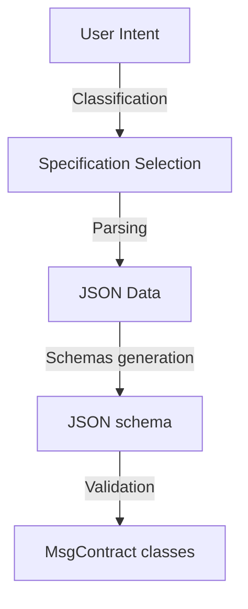

# Ntrn Agentic

This document describes the internal workflow and module interactions within the Ntrn Agentic project.

## Overview

Ntrn Agentic is a Rust-based project built on the [rig framework](https://github.com/0xPlaygrounds/rig/), designed to transform user intents expressed in natural language into deterministic JSON message schemas specifically for  Neutron. The project automates the creation and management of smart contracts by translating user intents into precise JSON specifications, prioritizing security, reliability, and accuracy in interactions with large language models (LLMs).

### High-Level Architecture

The project consists of these primary modules:

* **Query Classification**: Utilizes rig/extractor to classify incoming queries.
* **Specification, Parsing, and Validation**:

  * **Specification**: Retrieves the appropriate specifications based on the query class (https://github.com/neutron-org/neutron-dev-contracts).
  * **Parsing**: Converts user queries into structured JSON data according to these specifications.
  * **Validation**: Ensures that the parsed JSON data meets predefined standards.
* **Instantiation**: Creates message schemas.

### Workflow

The project's workflow clearly follows these modular steps:



#### 1. Query Classification

* **Input**: User intent expressed in natural language.
* **Operation**: Classifies the query using rig/extractor module.
* **Output**: Query class identifier.

#### 2. Specification, Parsing, and Validation

* **Input**: Query class identifier.
* **Operation**:

  * Selects relevant specifications based on the query class.
  * Parses user intent into structured JSON data.
  * Validates structured JSON against specifications.
* **Output**: Validated JSON data structure.

#### 3. Msg schema validation

* **Input**: Validated JSON specification.
* **Operation**: Prepares MsgContract schemas.
* **Output**: JSON schemas with interface description.

## Example Execution

To run examples of Ntrn Agentic instantiation pipeline from the command line:

```bash
cargo run --bin agent
```
