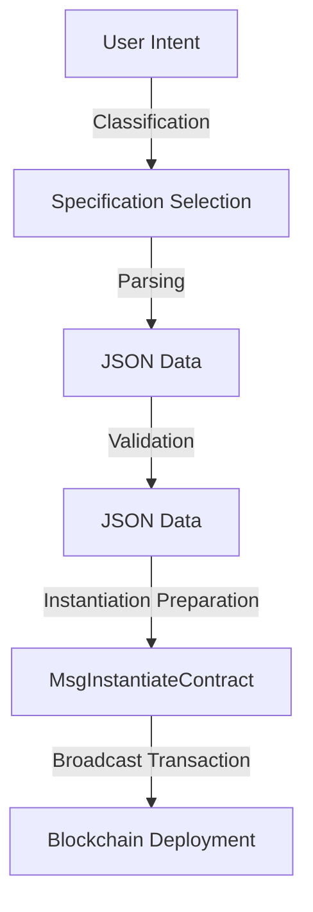

# Agentic ADO

This document describes the internal workflow and module interactions within the Agentic ADO project.

## Overview

Agentic ADO is a Rust-based project built on the [rig framework](https://github.com/0xPlaygrounds/rig/) using the Agentic API to transform user intents expressed in natural language into executable Andromeda Protocol Decentralized Objects (ADOs). The project automates the creation and management of ADOs, establishing a structured pipeline from user intent through JSON specifications to final contract deployment.

### High-Level Architecture

The Agentic ADO project consists of these primary modules:

* **Query Classification**: Utilizes git/extractor to classify incoming queries.
* **Specification, Parsing, and Validation**:

  * **Specification**: Retrieves the appropriate specifications based on the query class.
  * **Parsing**: Converts user queries into structured JSON data according to these specifications.
  * **Validation**: Ensures that the parsed JSON data meets predefined standards.
* **Instantiation**: Creates a MsgInstantiateContract stub, preparing it for contract deployment.

### Workflow

The project's workflow clearly follows these modular steps:



#### 1. Query Classification

* **Input**: User intent expressed in natural language.
* **Operation**: Classifies the query using git/extractor module.
* **Output**: Query class identifier.

#### 2. Specification, Parsing, and Validation

* **Input**: Query class identifier.
* **Operation**:

  * Selects relevant specifications based on the query class.
  * Parses user intent into structured JSON data.
  * Validates structured JSON against specifications.
* **Output**: Validated JSON data structure.

#### 3. Instantiation

* **Input**: Validated JSON specification.
* **Operation**: Prepares a MsgInstantiateContract message for contract deployment.
* **Output**: Ready-to-broadcast contract instantiation message.

## Example Execution

To run examples of Agentic ADO instantiation pipeline from the command line:

```bash
cargo run --bin agent
```
